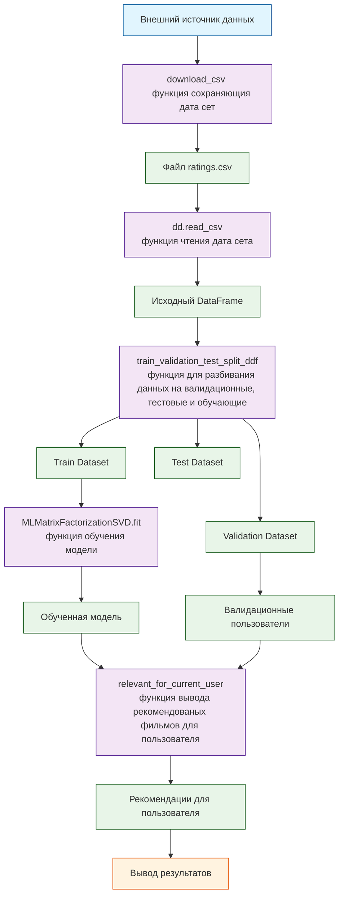
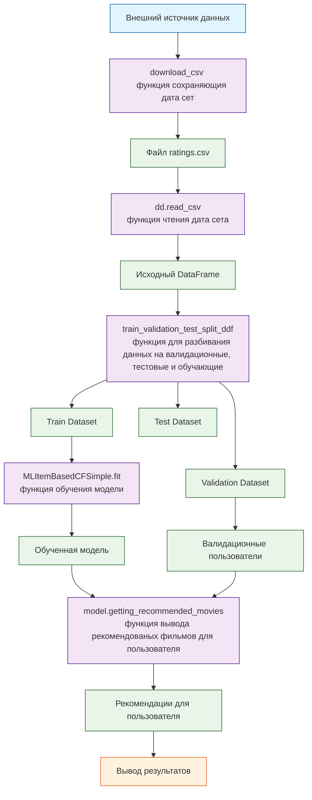
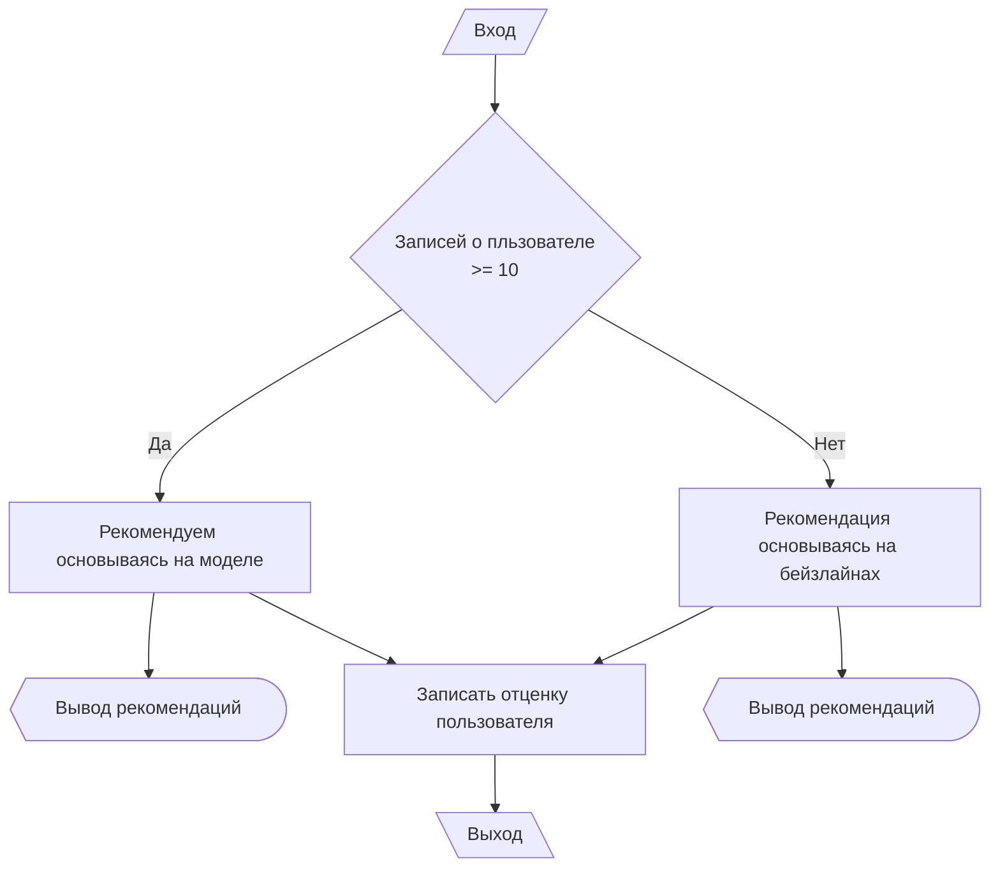

# Модель Матричной Факторизации (SVD):
## Схема потоков данных:

```mermaid
graph TD
    A[Внешний источник данных] --> B[download_csv 
    функция сохраняющия дата сет]
    B --> C[Файл ratings.csv]
    C --> D[dd.read_csv
    функция чтения дата сета]
    D --> E[Исходный DataFrame]
    E --> F[train_validation_test_split_ddf
    функция для разбивания данных на валидационные, тестовые и обучающие]
    F --> G[Train Dataset]
    F --> H[Validation Dataset]
    F --> I[Test Dataset]
    G --> J[MLMatrixFactorizationSVD.fit
    функция обучения модели]
    J --> K[Обученная модель]
    H --> L[Валидационные пользователи]
    K --> M[relevant_for_current_user
    функция вывода рекомендованых фильмов для пользователя]
    L --> M
    M --> N[Рекомендации для пользователя]
    N --> O[Вывод результатов]
    
    %% Стили для разных типов элементов
    classDef external fill:#e1f5fe,stroke:#01579b
    classDef process fill:#f3e5f5,stroke:#4a148c
    classDef data fill:#e8f5e8,stroke:#1b5e20
    classDef output fill:#fff3e0,stroke:#e65100
    
    class A external
    class B,D,F,J,M process
    class C,E,G,H,I,K,L,N data
    class O output
```

# Модель Item-based Collaborative Filtering:
## Схема потоков данных:

```mermaid
graph TD
    A[Внешний источник данных] --> B[download_csv 
    функция сохраняющия дата сет]
    B --> C[Файл ratings.csv]
    C --> D[dd.read_csv
    функция чтения дата сета]
    D --> E[Исходный DataFrame]
    E --> F[train_validation_test_split_ddf
    функция для разбивания данных на валидационные, тестовые и обучающие]
    F --> G[Train Dataset]
    F --> H[Validation Dataset]
    F --> I[Test Dataset]
    G --> J[MLItemBasedCFSimple.fit
    функция обучения модели]
    J --> K[Обученная модель]
    H --> L[Валидационные пользователи]
    K --> M[model.getting_recommended_movies
    функция вывода рекомендованых фильмов для пользователя]
    L --> M
    M --> N[Рекомендации для пользователя]
    N --> O[Вывод результатов]
    
    %% Стили для разных типов элементов
    classDef external fill:#e1f5fe,stroke:#01579b
    classDef process fill:#f3e5f5,stroke:#4a148c
    classDef data fill:#e8f5e8,stroke:#1b5e20
    classDef output fill:#fff3e0,stroke:#e65100
    
    class A external
    class B,D,F,J,M process
    class C,E,G,H,I,K,L,N data
    class O output
```
# Дерево принятия решений

```mermaid
flowchart TB

    C@{ label: "Записей о пльзователе<br style=\"--tw-scale-x:\">&gt;= 10" } -- Да --> D["Рекомендуем основываясь на моделе"]

    C -- Нет --> F@{ label: "<span style=\"color:\">Рекомендация основываясь на <font face=\"-apple-system,\"><span style=\"font-size:\">бейзлайнах</span></font></span>" }

    A["Вход"] --> C

    F --> n2["Записать отценку пользователя"] & n6["Вывод рекомендаций"]

    D --> n7["Вывод рекомендаций"] & n2

    n2 --> n8["Выход"]

  

    C@{ shape: diam}

    F@{ shape: rect}

    A@{ shape: lean-r}

    n2@{ shape: rect}

    n6@{ shape: display}

    n7@{ shape: display}

    n8@{ shape: lean-l}
```
